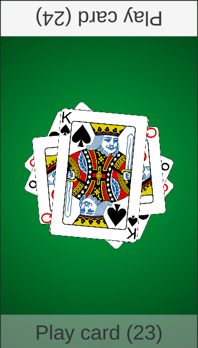

This is a variant of the Egyptian Rat Screw.

Each player is dealt 26 cards.

Players alternately discard one card from their hand.

Keep an eye on the following combinations of cards:
 * Double (e.g. 2-2)
 * Marriage (e.g. K-Q)
 * Sandwich (e.g. 2-5-2)
 * Divorce (e.g. Q-10-K)
 * Three in a Row (e.g. K-1-2, 3-4-5)

When a combination occurs players race to slap a discard pile.

The player who slaps first takes all the cards from the pile.

The penalty for slapping cards when there is no valid combination is that the other player takes all the cards.

The goal of the game is to have all 52 cards in your hand.

